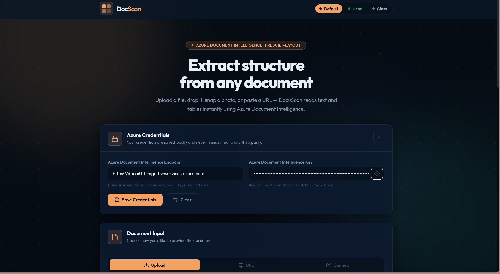
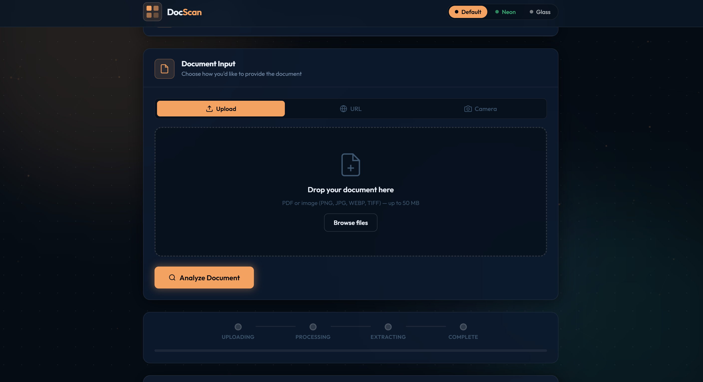
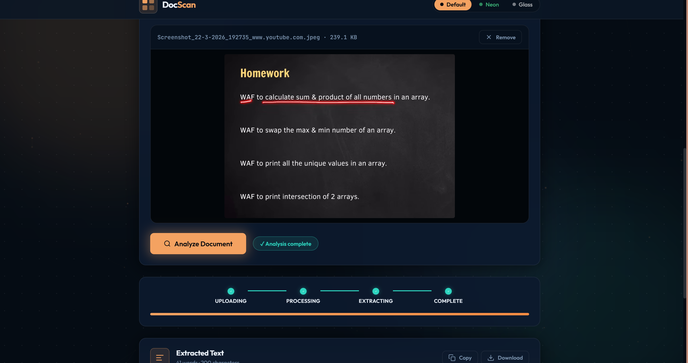

# Document-Scanner
<div align="center">

# 🔍 DocScan

### Azure Document Intelligence — Frontend Web App


<br>

**A modern frontend web app that extracts text and tables from documents directly in the browser using Azure Document Intelligence.**
No backend • No frameworks • Clean and simple architecture

<br>

[🌐 Live Demo](https://kavya25007.github.io/Document-Scanner/) • [🐞 Report Issue](../../issues)

</div>

---

## ✨ Overview

DocuScan is designed to make document analysis simple and accessible. Instead of setting up a backend or complex tools, this app works entirely in the browser.

You just provide your **Azure Document Intelligence endpoint and key**, upload a document, and the app processes it and shows structured results like text and tables.

This makes it useful for:

* Students working with scanned notes
* Developers exploring Azure AI services
* Anyone needing quick document data extraction

---

## 🚀 How It Works

1. You enter your Azure Document Intelligence credentials
2. Upload a file (or use drag & drop, camera, or URL)
3. The app sends the document for processing
4. It continuously checks the result (polling)
5. Once ready, it displays:

   * Extracted text
   * Structured tables

Everything happens directly in your browser — no backend involved.

---

## 🖼️ Preview

### 🏠 Main Interface



### 📤 Upload Section





### 📊 Extracted Results


--

## 🎯 Features

### 📤 Flexible Input Options

You can add documents in multiple ways:

* Upload files (PDF or images)
* Drag and drop directly into the page
* Capture using your camera
* Paste a document URL

### 📄 Smart Extraction

The app processes documents and extracts:

* Full text content
* Tables with proper structure

### ⚡ Productivity Tools

* Copy extracted text in one click
* Download results as a `.txt` file

### 🎨 Modern UI Experience

* Clean card-based layout
* Glassmorphism design effects
* Smooth animations and hover interactions
* Theme switching (Default, Neon, Glass)

### 💾 Local Storage Support

Your endpoint, key, and selected theme are saved in your browser for convenience.

---

## 📁 Project Structure

```id="r3pz7x"
index.html     → Defines layout and UI  
styles.css     → Handles design, themes, animations  
script.js      → Manages logic, processing, and UI updates  
```

---

## 🛠️ Tech Stack

This project is built using simple and modern web technologies:

* HTML5 for structure
* CSS3 for styling and animations
* Vanilla JavaScript for logic and interactions
* Azure Document Intelligence for document processing

---

## 🔐 Security

* Your credentials stay in your browser
* No backend or database involved
* No tracking or third-party scripts
* Data is sent directly to Azure

---

## ⚠️ Important Notes

* URL input must be publicly accessible
* Camera works only on HTTPS or localhost
* Very large files may affect performance

---

## 📌 Setup Tip

Your endpoint will look like:

```id="j2x7df"
https://your-resource.cognitiveservices.azure.com/
```

---

## 🌟 Future Improvements

Some ideas to enhance this project further:

* Export tables as CSV
* Multi-language support
* Dark/light auto mode
* History of analyzed documents

---

## 📄 License

MIT License

---

<div align="center">

✨ Built using Azure Document Intelligence and pure frontend technologies

</div>
